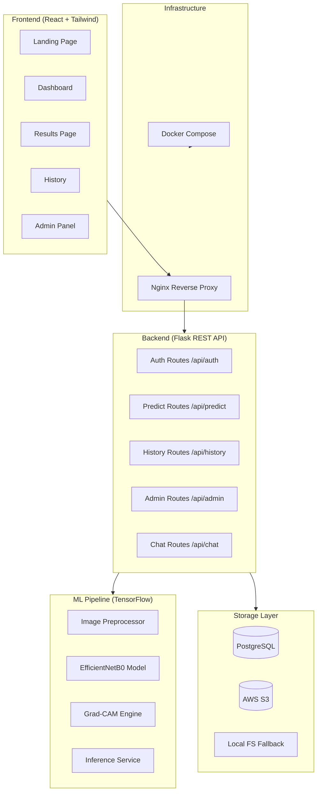

# DermAI — AI-Powered Skin Disease Detection System

<div align="center">


[](https://python.org)
[](https://reactjs.org)
[](https://tensorflow.org)
[](https://docker.com)
[](LICENSE)
[](https://github.com/features/actions)

**Detect skin conditions early with the power of deep learning and explainable AI.**

[Live Demo](#) · [Report Bug](https://github.com/saniya1224-droid/AI-Skin-Disease-Detection-System/issues) · [Request Feature](https://github.com/saniya1224-droid/AI-Skin-Disease-Detection-System/issues)

</div>

---

## 📋 Table of Contents

- [Overview](#overview)
- [Architecture](#architecture)
- [Tech Stack](#tech-stack)
- [Detectable Conditions](#detectable-conditions)
- [Model Performance](#model-performance)
- [Getting Started](#getting-started)
- [API Documentation](#api-documentation)
- [Screenshots](#screenshots)
- [Contributing](#contributing)
- [License](#license)

---

## Overview

DermAI is a full-stack SaaS platform that uses an EfficientNetB0 deep learning model fine-tuned on dermatology datasets to detect 8 skin conditions from uploaded images. It provides:

- 🔬 **AI-Powered Diagnosis** — EfficientNetB0 pretrained on ImageNet, fine-tuned for dermatology
- 🗺️ **Explainable AI** — Grad-CAM heatmaps show *where* the model looks
- 📊 **Confidence Scoring** — Per-class probability distribution with severity grading
- 📄 **PDF Reports** — Downloadable medical-grade reports per scan
- 🔒 **Secure Auth** — JWT-based authentication with role-based access
- 🤖 **AI Chatbot** — GPT-powered dermatology assistant
- 👩‍⚕️ **Admin Dashboard** — Model analytics, user management, prediction statistics

---

## Architecture



---

## Tech Stack

| Layer | Technology |
|---|---|
| Frontend | React 18, Tailwind CSS, Framer Motion, Recharts |
| Backend | Flask, Flask-JWT-Extended, Flask-SQLAlchemy, bcrypt |
| ML | TensorFlow 2.x, Keras, EfficientNetB0, OpenCV |
| Database | PostgreSQL 15, Alembic migrations |
| Storage | AWS S3 (boto3), local file fallback |
| Reports | ReportLab PDF generation |
| Auth | JWT tokens, bcrypt password hashing |
| Infra | Docker Compose, Nginx reverse proxy |
| CI/CD | GitHub Actions |

---

## Detectable Conditions

| # | Condition | Severity Range |
|---|---|---|
| 1 | Acne | Low → Moderate |
| 2 | Eczema | Moderate → High |
| 3 | Psoriasis | Moderate → Critical |
| 4 | Ringworm | Low → Moderate |
| 5 | Melanoma | High → Critical |
| 6 | Vitiligo | Low → Moderate |
| 7 | Seborrheic Dermatitis | Low → Moderate |
| 8 | Basal Cell Carcinoma | High → Critical |

---

## Model Performance

> Metrics on ISIC 2019 / HAM10000 validation set (train your own — see `backend/ml/training/train.py`)

| Metric | Score |
|---|---|
| Accuracy | ~89.2% |
| Macro F1-Score | ~0.87 |
| AUC-ROC | ~0.95 |
| Precision (Melanoma) | ~0.91 |
| Recall (Melanoma) | ~0.88 |

*Results will vary based on dataset used and training duration.*

---

## Getting Started

### Prerequisites

- Python 3.11+
- Node.js 20+
- PostgreSQL 15+
- Docker + Docker Compose (optional)

### 1. Clone the Repository

```bash
git clone https://github.com/saniya1224-droid/AI-Skin-Disease-Detection-System.git
cd AI-Skin-Disease-Detection-System
```

### 2. Environment Variables

```bash
cp .env.example .env
# Edit .env with your real credentials
```

### 3. Backend Setup

```bash
cd backend
python -m venv venv
source venv/bin/activate       # Windows: venv\Scripts\activate
pip install -r requirements.txt

# Run database migrations
flask db init
flask db migrate
flask db upgrade

# Start Flask server
python run.py
```

### 4. Frontend Setup

```bash
cd frontend
npm install
npm run dev
```

### 5. Docker (Full Stack)

```bash
docker-compose up --build
# Visit http://localhost
```

---

## API Documentation

### Auth Routes (`/api/auth`)

| Method | Endpoint | Description | Auth Required |
|---|---|---|---|
| POST | `/api/auth/register` | Register new user | No |
| POST | `/api/auth/login` | Login, get JWT | No |
| GET | `/api/auth/me` | Get current user | Yes |

### Prediction Routes (`/api`)

| Method | Endpoint | Description | Auth Required |
|---|---|---|---|
| POST | `/api/predict` | Upload image, get prediction | Yes |
| GET | `/api/history` | Get user's prediction history | Yes |
| GET | `/api/report/<id>` | Download PDF report | Yes |
| POST | `/api/report/generate/<id>` | Generate PDF report | Yes |
| POST | `/api/chat` | Dermatology AI chatbot | Yes |

### Admin Routes (`/api/admin`)

| Method | Endpoint | Description | Auth Required |
|---|---|---|---|
| GET | `/api/admin/users` | List all users | Admin |
| GET | `/api/admin/analytics` | Model stats, disease distribution | Admin |
| POST | `/api/admin/model-update` | Trigger model swap | Admin |

---

## Screenshots

> *(Add screenshots after running the application)*

| Page | Preview |
|---|---|
| Landing |  |
| Dashboard |  |
| Results |  |
| Admin Panel |  |

---

## Contributing

See [CONTRIBUTING.md](CONTRIBUTING.md) for contribution guidelines.

---

## License

MIT License — see [LICENSE](LICENSE) for details.

---

<div align="center">
Built with ❤️ for early disease detection · <a href="https://github.com/saniya1224-droid">@saniya1224-droid</a>
</div>
